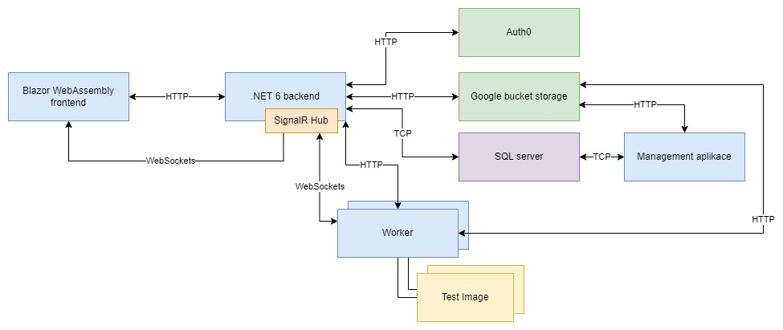

## Úvod
Projekt se zabývá implementací internetové služby, která umožňuje uživatelům spouštět úlohy. V projektu je implementováno REST API rozhraní pro 
spouštění úloh. Ty se spouští jako docker kontejner. Dále je implementován systém administrace a systém zpoplatnění za spuštěné úlohy.

Služba je implementována ve frameworku .NET 6. Pro ukládání uživatelských souborů se využívá služba Google bucket storage. Pro autentizaci a autorizaci se
zvolila služba Auth0.

Projekt je aktuálně nasazený na Azure na této adrese <https://auth0blazorwasmserverapp.azurewebsites.net/>. Worker procesy/kontejnery jsou vypnuty z důvodu ceny provozu.

## Spuštění projektu
Projekt se spouští přes docker-compose. Nejdříve je ale potřeba vytvořit testovací image, který bude spouštěn a bude simulovat výpočet.
V kořenovém adresáři spusťte příkaz: ```docker build -t testimage -f .\TestImage\Dockerfile .```

Poté celý projekt spustíte přes ```docker-compose -f .\docker-compose.yml up --build```. Tento proces může trvat několik minut. 
Výsledkem by měly být čtyři spuštěné docker kontejnery.\
Na této adrese <https://localhost:5001/> je dostupná webová aplikace.\
Na této adrese <https://localhost:5001/swagger/index.html> je dostupná OpenApi dokumentace.


V takto spuštěném projektu se používá vývojářský certifikát vygenerovaný přes .NET CLI, aby fungoval provoz přes HTTPS.
Je možné, že se vyskytne chyba související s tímto certifikátem (typicky SSL výjimka, certifikát není důvěryhodný apod.).
Projekt tak nebude fungovat a certifikát se bude muset vygenerovat nový.

Pro vytvoření a ověření vývojářského certifikátu jsou potřeba tyto kroky:
* Stažení .NET 6 SDK https://dotnet.microsoft.com/download/dotnet/6.0
* Přejít do hlavního adresáře projektu a zadat ```dotnet dev-certs https -ep .\https\aspnetapp.pfx -p mypass123```
* Potom vše restartujte příkazy: ```docker-compose down```, ```docker-compose -f .\docker-compose.yml up --build```.

Poté by mělo vše fungovat správně. Na adrese <https://localhost:5001/> se vpravo nahoře můžete přihlásit
nebo zaregistrovat. Zde je tabulka již existujících uživatelů. U všech je heslo nastavené na ```Password123*```.

| Uživatelský email            | Popis                                                   |
|------------------------------|---------------------------------------------------------|
| testadmin@example.com        | Administrator                                           |
| tomashavel@test.com          | Vip, ověřený, registrovaný uživatel                     |
| filipnovak@test.com          | Normální, ověřený, registrovaný uživatel                |
| stepannemec@test.com         | Vip (byl i normální), ověřený, registrovaný uživatel    |
| jakubstefacek@test.com       | Normální, neověřený, neregistrovaný uživatel            |
| testadmin@example.com        | Normální, ověřený, neregistrovaný uživatel              |

Vysvětlení popisu:
* **Ověřený** - Ověřený přes e-mail
* **Neregistrovaný** - Uživatel je přihlášen k auth0, ale nedokončil registraci do aplikace

## Konfigurace projektu
Projekt lze konfigurovat přes konfigurační proměnné v docker compose souboru ```docker-compose.yml```.
Konfigurační proměnné jsou definovány v souborech ```appsettings.json``` a lze je přepsat z docker compose souboru nebo z jiných nasazovacích nástrojů.

Konfigurační soubor ```TaskLauncher.App/Server/appsettings.json``` slouží ke konfiguraci
serveru. Lze měnit nastavení poskytovatele identity, připojovací řetězec k databázi,
váhy front s úlohami a podobně.

Hodnoty, které se mohou měnit a neovlivní zásadně chod serveru:
* **SeederConfig__seed**: Pokud je nastaveno na ```true```, vytvoří se testovací uživatelé s testovacími daty (pouze pokud je prázdná databáze). 
Pokud je hodnota nastavena ```false```, je tato funkce vypnuta.
* **PriorityQueues__Queues__nonvip**: Určuje, jakou váhu má nastavená fronta s neprioritními úlohy.
* **PriorityQueues__Queues__vip**: Určuje, jakou váhu má nastavená fronta s prioritními úlohy.
* **PriorityQueues__Queues__cancel**: Určuje, jakou váhu má nastavená fronta s úlohy, které nečekaně selhaly z důvodu odpojení workera nebo vyvolené nečekané vyjímky.

Další konfigurací je soubor ```TaskLauncher.Routines/appsettings.json```. Ten konfiguruje aplikaci vykonávající rutinní, údržbové práce. Tyto proměnné by se měnit neměly.

Poslední konfigurační soubor je ```TaskLauncher.Worker/appsettings.json```. Ten konfiguruje worker aplikaci, která spouští kontejner simulující výpočet.

Hodnoty, které se zde mohou měnit:
* **TaskLauncherConfig__Target**: Určuje cestu v kontejneru, kam bude namontován volume. Nedoporučuje se měnit tuto proměnnou, protože ji používá i spuštěný kontejner s výpočtem.
* **TaskLauncherConfig__Source**: Jméno volume. Stejný volume by měl být přimontován jak k worker kontejneru, tak k workerem spuštěnému kontejneru. Jinak
bude worker ukládat soubor jinam a kontejner s výpočtem nebude moct do tohoto souboru zapsat výsledek výpočtu.
* **TaskLauncherConfig__ImageName**: Jméno testovacího image, který se bude spouštět s volume (definováno proměnnými Target a Source).
* **TaskLauncherConfig__ContainerArguments__Mode**: Zde jsou možné pouze dvě možnosti: "seconds", "minutes". Určuje jednotku času v dalších proměnných.
* **TaskLauncherConfig__ContainerArguments__Min**: Minimální možný čas, po který poběží spuštěný kontejner s výpočtem. Jednotku určuje proměnná Mode.
* **TaskLauncherConfig__ContainerArguments__Max**: Maximální možný čas, po který poběží spuštěný kontejner s výpočtem. Jednotku určuje proměnná Mode.
* **TaskLauncherConfig__ContainerArguments__Max**: Určuje šanci na úspěch úlohy (zadává se jako desetinné číslo od 0 do 1 s tečkou).
 
## Simulace
Spuštění simulace probíhá opět pomocí docker-compose. Tentokrát se v příkazu uvede 
soubor s konfigurací pro simulaci ```docker-compose -f .\docker-compose.simulation.yml up --build```. Opět je nutné mít testovací image (viz Spuštění projektu).

Simulace vytvoří několik standardních a několik vip uživatelů. Ti pak vytvoří několik úloh, každý po určité době.
Všechny tyto hodnoty jsou opět konfigurovatelné. Pro nahlédnutí výsledku nebo fronty se přihlaste do aplikace
na adrese <https://localhost:5001/> jako administrátor nebo jako uživatel, který se v simulaci vygeneroval.
Heslo je vždy stejné: ```Password123*```. Email se získá z logu, který produkuje simulace.

## Konfigurace simulace
V simulaci se nespouští management aplikace, takže související proměnné nelze konfigurovat.
Zbývající proměnné jsou stejné jako u standardního spuštění projektu.
K těmto proměnným přibyly proměnné z konfigurace v souboru ```TaskLauncher.Simulation/appsettings.json```

Hodnoty, které se mohou měnit a neovlivní zásadně chod:
* **SimulationConfig__VipUsers**: Nastavuje počet vygenerovaných vip uživatelů.
* **SimulationConfig__NormalUsers**: Nastavuje počet standardních uživatelů.
* **SimulationConfig__TaskCount**: Nastavuje počet úloh, který každý vytvořený uživatel vytvoří.
* **SimulationConfig__DelayMin**: Nastavuje spodní hranici časového intervalu v sekundách. Z intervalu se náhodně vygeneruje zpoždění, po kterém se opět spustí další úloha.
* **SimulationConfig__DelayMax**: Nastavuje horní hranici časového intervalu v sekundách. Z intervalu se náhodně vygeneruje zpoždění, po kterém se opět spustí další úloha.

### Architektura:
Projekt je tvořen několika částmi
* Webová aplikace
* SQL server databáze
* Management aplikace
* Aplikace spouštějící výpočty - Worker
* Google bucket storage
* Auth0

### Schéma:


### Webová aplikace
Aplikace byla vytvořena pomocí frameworku .NET 6. Využil se hostovací model Blazor WebAssembly ASP.NET Core hosted.
Tento model je hostován na serveru Kestrel. Vznikají dvě části (dvě aplikace): frontend aplikace (SPA) a backend k frontend aplikaci (BFF). 
Jelikož jsou obě tyto části hostovány na serveru Kestrel, vzniká jediný kontejner a obě aplikace sdílí stejnou doménu.
Pokud se přistoupí na url adresu <https://{doména}/..> z prohlížeče. Otevřou se klasicky statické webové stránky (akorát pomocí WebAssembly).
Pokud se přistupuje na url adresu <https://{doména}/api/..> přistupuje se k REST API. Doména je v lokálním spuštění <localhost:5001>.
Tento model byl zvolen kvůli jednoduššímu nasazení celé aplikace. Navíc je server Kestrel schopný spolehlivě hostovat backend aplikace (REST API) a zároveň 
poskytovat statické soubory do prohlížeče.

Pokud by existoval nějaký požadavek, který by vyžadoval rozdělení tohoto modelu na více kontejnerů (SPA, REST API), lze jednoduše vybrat jiný hostovací model.
Stačí změnit pouze konfigurační soubory, kód se v podstatě nemusí měnit.

Alternativní hostovací modely:
1. REST API (ASP.NET Core 6 backend) by zůstalo na serveru Kestrel, statické stránky (SPA) by se mohly hostovat na jiné instanci
Kestrel serveru v jiném kontejneru pomocí modelu Blazor WebAssembly nebo na kompletně jiném serveru jako je třeba Nginx.
2. REST API by se opět neměnilo a Blazor aplikace by se nechala nasadit pomocí modelu Blazor Server.

Frontend aplikace komunikuje s backend aplikací klasicky přes REST API. Blazor aplikace se dále připojuje na SignalR Hub, který zasílá uživatelům notifikace. Hub je hostovaný v backend aplikaci (.NET 6). Tak jak jsou v REST API koncové body, tak zde vznikají další koncové body akorát pro SignalR.
Backend aplikace obsluhuje databázi a komunikuje se službou Google bucket storage pro ukládání souborů. Dále komunikuje se službou Auth0, která zajišťuje
autentizaci a autorizaci uživatelů. Server rozděluje úlohy worker aplikacím. Pomocí algoritmu round-robin se zajišťuje, aby neprioritní úlohy nehladověly. Server posílá zprávy worker aplikacím pomocí SignalR.

Pro přístup na REST API z prohlížeče se musí uživatel autentizovat a autorizovat pomocí cookie autentizace zajištěné přes Auth0.
Uživatel se k API může dostat i z klasické desktop aplikace, přes přístupový token, který získá přihlášením přes API, které volá Auth0 vystavující daný token.

### Management aplikace
Tato aplikace má za úkol vykonávat rutinní práce jako mazání starých souborů. Aplikace byla implementována
pomocí balíčku Hangfire pro .NET. Balíček umí plánovat práce a vykonávat je po určité době. Pokud se objeví nový požadavek, například
mazat neaktivní uživatele apod. Lze rutinu naprogramovat a naplánovat ji do této aplikace.

### Aplikace spouštějící výpočty - Worker
Aplikace má za úkol spouštět výpočty. Jakmile do aplikace přijde zpráva (ze SignalR Hub, ze serveru) obsahující informaci o zahájení výpočtu, 
aplikace zahájí výpočet. Z Google storage se stáhne soubor, ten se uloží do namontovaného volume a spustí se kontejner se stejným volume. Kontejner, který simuluje 
výpočet zapíše výsledek do souboru. Worker aplikace pak soubor zpátky nahraje na Google. Veškeré události worker zasílá na SignalR Hub nebo REST API. Pokud worker náhle ukončí spojení, Hub je o tom informován a úlohu znovu vloží do fronty na serveru. Worker implementuji i ochranu proti zacyklení úlohy. Pokud se úloha nesplní do určité doby, zasílá informaci na server. Události, které se posílají na server (úloha se dokončila úspěšně, neúspěšně apod.), vidí daný přihlášený uživatel v reálném čase (díky SignalR spojení).