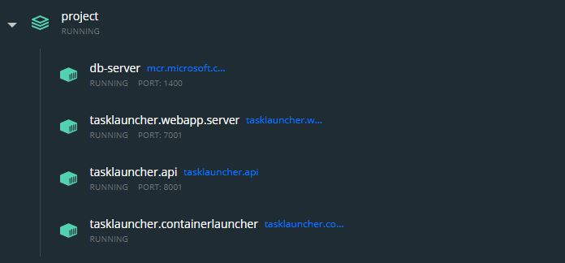

## Spuštění
Projekt se spouští přes docker-compose, nejdříve je ale potřeba vytvořit testovací image, který bude spouštěn a bude simulovat výpočet.
V kořenovém adresáři projektu zadejte: ```docker build -t bptest -f .\TestImage\Dockerfile .```

Poté celý projekt spustíte přes ```docker-compose up --build```. Tento proces může trvat 
několik minut. Výsledkem by měly být čtyři spuštěné docker kontejnery.\
Na této adrese https://localhost:7001/ je dostupná frontend aplikace.\
Na této adrese https://localhost:8001/swagger/index.html je dostupné webové api (OpenApi dokumentace).



V projektu zatím používám vývojářský  certifikát vygenerovaný přes .NET CLI, aby fungovalo HTTPS.
Je možné, že se vyskytne chyba související s tímto certifikátem (typicky SSL výjimka, certifikát není důvěryhodný apod.).
Projekt tak nebude fungovat a certifikát se bude muset vygenerovat nový.

Pro vytvoření a ověření vývojářského certifikátu jsou potřeba tyto kroky:
* Stažení .NET 6 SDK https://dotnet.microsoft.com/download/dotnet/6.0
* Přejít do hlavního adresáře projektu a zadat ```dotnet dev-certs https -ep .\https\aspnetapp.pfx -p mypass123```
* Potom vše restartujte: ```docker-compose down```, ```docker-compose up --build```.

Potom by mělo vše fungovat správně. Na adrese https://localhost:7001/ se vpravo nahoře přihlaste - testovací přihlašovací údaje jsou: ```email: testuser@example.com```, ```heslo:Password123*```. Na kartě ```tasks``` zkuste vytvořit nový výpočet a pak ho spustit. Po spuštění výpočtu se bude automaticky aktualizovat stav výpočtu
(real-time zprávy se dají pozorovat i v konzoli prohlížeče). Po dokončení lze stáhnout soubor s výsledkem. \
Upozornění: Nejsou implementovány všechna opatření, v krajních případech se tak můžou vyskytnout chyby.

## Krátký popis
Projekt je implementován v .NET 6 frameworku. Dále se používá služba 
Google bucket storage pro ukládání uživatelských souborů a služba Auth0 
pro autentizaci a autorizaci.

### Architektura:
Projekt je rozdělen na čtyři části (vzniknou čtyři docker image).
1. Web Api
2. SQL databáze
3. Blazor frontend aplikace
4. Aplikace spouštějící výpočty

#### Schéma:


#### Web Api
Obsluhuje databázi a komunikuje se službou Google bucket storage pro ukládání souborů.
Pro přístup na toto Api je potřeba se autorizovat pomocí JWT Bearer. Klientské
aplikace tento autorizační token získají posláním dotazu na Auth0 spolu se svými soukromými údaji. 

#### Blazor frontend aplikace
Frontend aplikace je implementována pomocí technologie Blazor .NET Core ASP.NET Hosted, který umožňuje architekturu BFF (Backend for frontend).
Cílem této architektury je větší bezpečnost a možnost implementace přihlašování přes OpenIdConnect. Díky tomu, že část aplikace je na serveru,
informace jako ```clientId``` a ```clientSecret``` se nikdy nedostanou do prohlížeče, stejně jako autorizační tokeny. Pokud klientská
aplikace potřebuje provést HTTP dotaz na Web Api, pošle ho na tuto serverovou část, kde se přidá autorizační token a je přeposlán na Web Api.
Přihlašovaní do aplikace zajišťuje služba Auth0 přes OpenIdConnect.

Tento server dále hostuje SignalR Hub pro real-time komunikaci mezi Frontend aplikací a
aplikací, která spouští výpočty. Tento SignalR Hub může být oddělen a existovat na jiném
serveru (vytvořil by se další docker image).

#### Aplikace spouštějící výpočty
Aplikace má za úkol spouštět výpočty. Jakmile do aplikace začnou přicházet zprávy (ze SignalR Hub) obsahující informaci o zahájení výpočtu, 
začnou se hromadit do fronty. Aplikace pak postupně spouští výpočet za výpočtem, dokud není fronta prázdná, jinak aplikace čeká až přijde další
zpráva o zahájení dalšího výpočtu.
Než aplikace spustí výpočet, tak vždy stáhne soubor pomocí dotazu na Web Api. Následně spustí docker image s mountem k tomuto souboru. 
Jakmile výpočet skončí, aplikace uloží výsledný soubor opět pomocí dotazu na Web Api. Mezitím probíhá několik dotazů na Web Api, které aktualizují stav výpočtu.
Současně se přes SignalR posílají real-time zprávy do frontend aplikace.

Aplikace zatím funguje pouze tak, že spustí testovací docker image a pouze výpočet simuluje. Dále se zatím používá fronta, ale do budoucna nebude nic
bránit tomu, aby se výpočty spouštěly paralelně.
